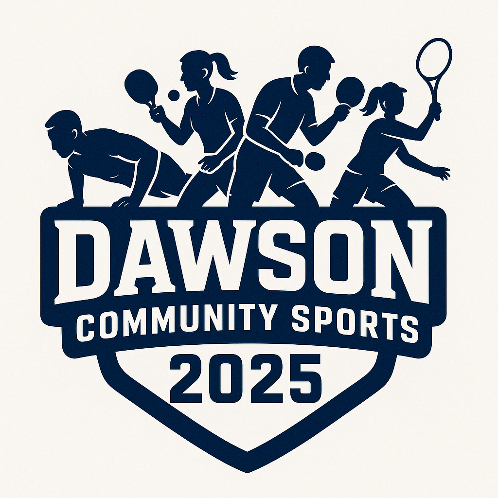

# 🏆 Dawson Community Sports 2025

Welcome to the official website source code for **Dawson Community Sports 2025** – a vibrant, inclusive, and energetic community fitness challenge hosted in Dawson County!

 <!-- Optional if you upload a logo -->

## 🏡 About the Event

**Dawson Community Sports 2025** is an inter-subdivision sports showdown aimed at promoting fitness, fun, and community spirit. Families and neighbors will compete in various athletic events, showcasing talent and camaraderie across subdivisions.

📅 **Event Day:** May 17, 2025  
📍 **Location:** To Be Decided  
📧 **Contact:** ddmsports25@gmail.com

---

## 🚀 Live Website

🌐 [https://www.dawsoncommunitysports.online](https://www.dawsoncommunitysports.online)

---

## 🎯 Key Features

- ✨ Static site built with **React + Vite + Tailwind CSS**
- 📆 Clear **timeline of events** and important dates
- 🏓 Modular, responsive **event cards** for featured competitions
- 📬 Easy-to-access contact and registration info
- ⚡ Hosted via **GitHub Pages** with **custom domain + SSL**

---

## 📋 Timeline

| Event                          | Date              |
|-------------------------------|-------------------|
| Registration Deadline         | April 18, 2025    |
| Steps/Miles Logging Window    | April 21 – May 16 |
| In-Person Finals              | May 17, 2025      |
| Winner Announcements          | May 17 Evening    |

---

## 🥇 Competitions

### 👨 Men’s Events
- Pushup Challenge
- Pickleball
- Table Tennis
- Tennis
- Walk / Jog (App Logged)

### 👩 Women’s Events
- Carroms
- Plank Challenge
- Badminton
- Walk (App Logged)

### 👫 Open Category
- Walk / Jog Challenge (Team of 2 – Any Gender)

---

## 🛠️ Tech Stack

- **React** (with TypeScript)
- **Vite** for blazing fast builds
- **Tailwind CSS** for modern styling
- **GitHub Pages** for hosting
- **gh-pages** package for deployment automation

---

## 📦 Project Structure
📁 src/ ├── App.tsx # Main React component ├── main.tsx # App entry point ├── index.css # Tailwind setup 📄 index.html # App container 📄 CNAME # Custom domain setup


---

## 🧑‍💻 Local Development

```bash
npm install
npm run dev

To build and preview:

npm run build
npm run preview
```

🚀 Deployment
This project uses the gh-pages branch and GitHub Actions to deploy from master.

To manually deploy (optional):
```
npm run build
npm run deploy
```
🧭 License
MIT © 2025 Dawson Community Sports Team